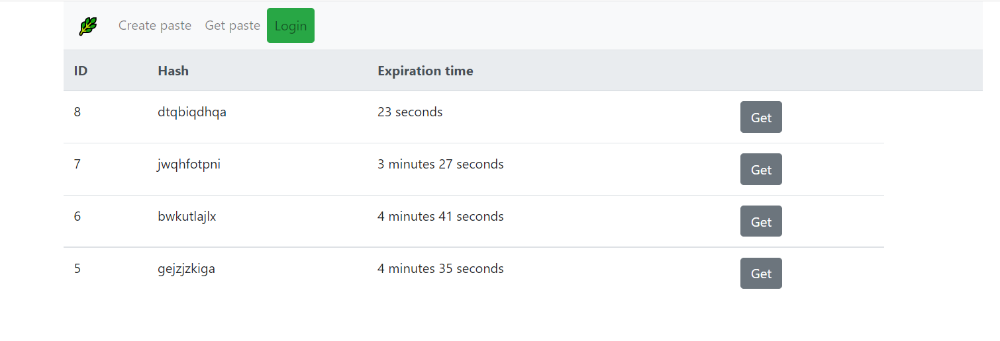
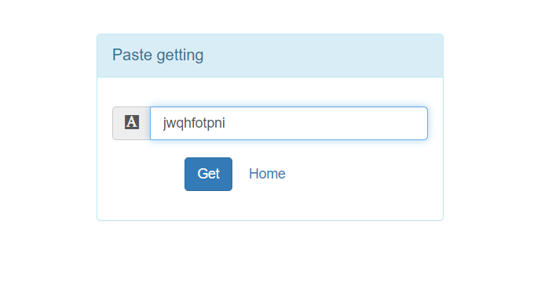
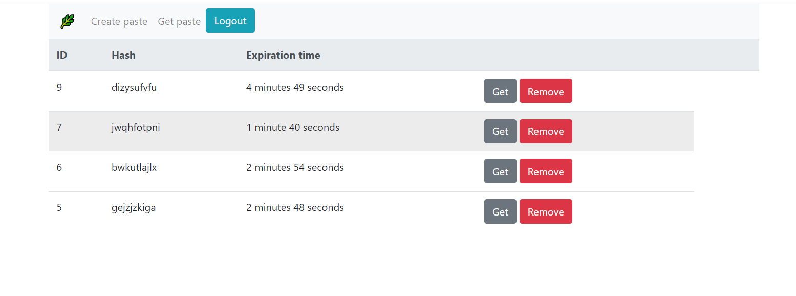
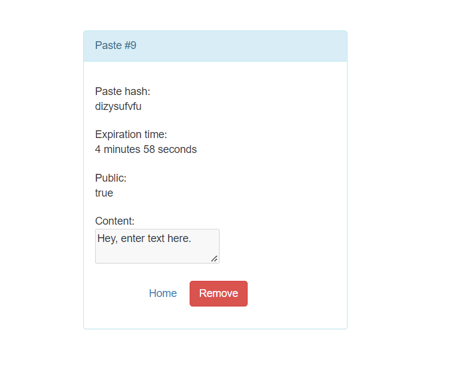
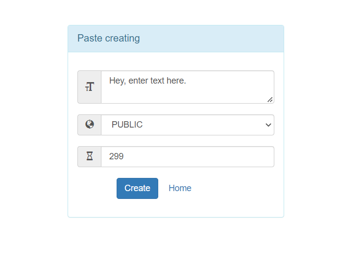
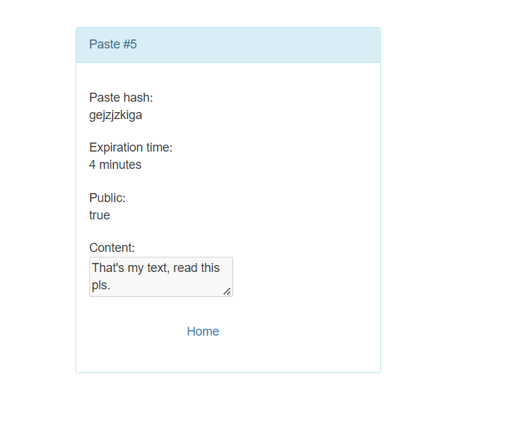

# PasteProj
Initially, it was an usual rest service - https://gitlab.com/shibkov.k/pastebox, but I finished it by adding pages, validating, database and others and this is what happened. You can create your own paste, specify: text, expiration time, public or unlisted status, the last 20 public pastes appear in the main page. After creating a paste, it has own hash by which you can access its details as text, id, hash and others. Minimum value for expiration time is 15 seconds, maximum 300. Every 10 seconds the program’s checking for expired pastes and delete expired. Also I've configured a security with roles and permissions. At the end we have a few tests for almost all the methods in the service, except the schedulded.

 
#### Pages: homepage, createpage, getpage, nullgetpage
#### 3 roles in the system: Guest, User, Admin
#### 2 permissions in the system: "paste:create", "paste:remove"

- Guest (authorization is not required)\
Can see last public pastes on the homepage, get any paste by hash.

- User (authorization is required)\
Permissions: "paste:create"\
Can do whatever the guest. Also create a new paste.\
Login: User, password: 100

- Admin (authorization is required)\
Permissions: "paste:create", "paste:remove"\
Can do whatever the user. Also remove any paste.\
Login: Admin, password: 100

### Techonology stack: 
Spring (Boot, MVC, Thymeleaf, Security) \
JDBC, Hibernate \
JUnit, Mockito \
PostgreSQL DB

Simple service where you can create your own Paste, specify: text, expiration time, public or unlisted status, the last 20 public pastes appear on the main page. By hash you can access the paste details.
